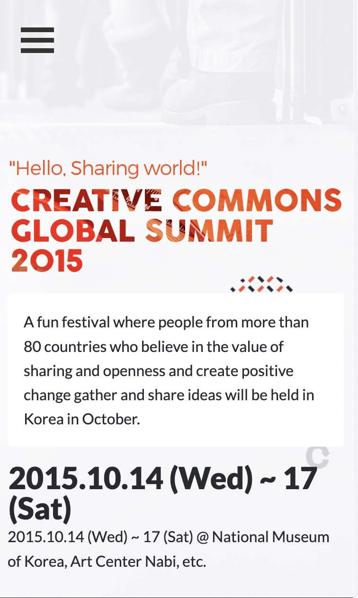
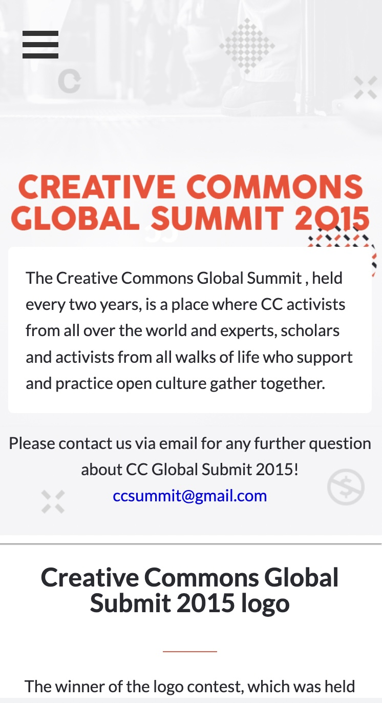
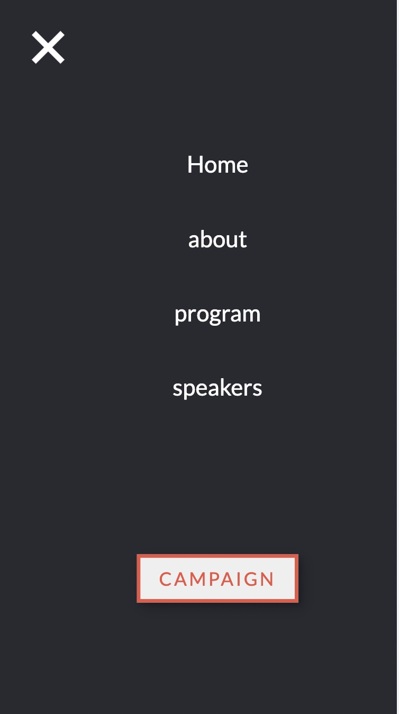
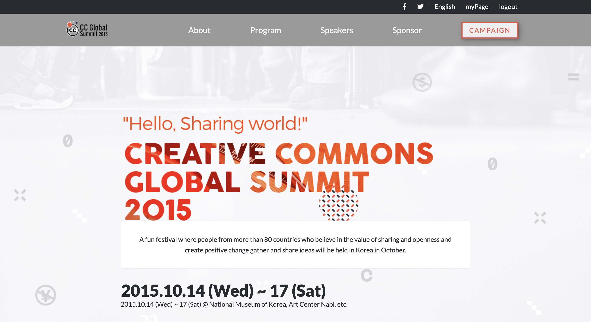
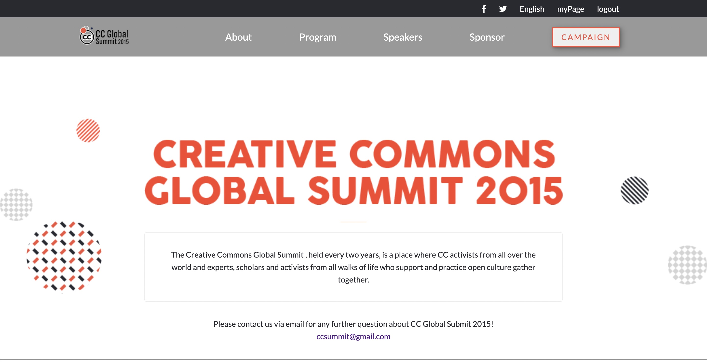

# Capstone Project
> in this capstone project I build an online website using the guidline design given below:
- https://www.behance.net/gallery/29845175/CC-Global-Summit-2015

## built with
- semantic HTML tags
- best practices in HTML code
- CSS selectors correctly
-  CSS box model
- Flexbox to place elements in the page
- media queries
- GitHub Pages to deploy web pages
- JavaScript to manipulate DOM elements
- JavaScript events
-  objects to store and access data

## Live Demo
- https://mohamedhnoor.github.io/capstoneProject/

# WORK FLOW SCREENSHOTS

## Prerequisites
- computer with internet
- visual studio code

## Author
- GitHub: [@githubhandle](https://github.com/MohamedHNoor)
- Twitter: [@twitterhandle](https://twitter.com/MohamedHNoor)
- LinkedIn: [@linkedinhandle](https://www.linkedin.com/in/mohamedhnoor/)

## 🤝 Contributing
Contributions, issues, and feature requests are welcome!

Feel free to check the issues page.

## Show your support
Give a ⭐️ if you like this project!

## Acknowledgments

- Cindy Shinon Behance for her UI design template

## 📝 License

This project is [MIT](MIT.md) licensed.

_NOTE: we recommend using the [MIT license](https://choosealicense.com/licenses/mit/) - you can set it up quickly by [using templates available on GitHub](https://docs.github.com/en/communities/setting-up-your-project-for-healthy-contributions/adding-a-license-to-a-repository). You can also use [any other license](https://choosealicense.com/licenses/) if you wish._
